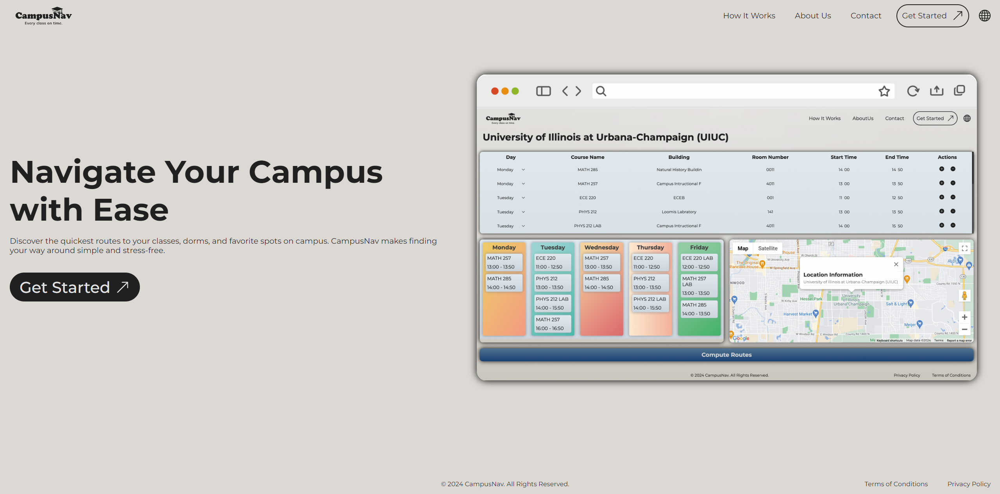
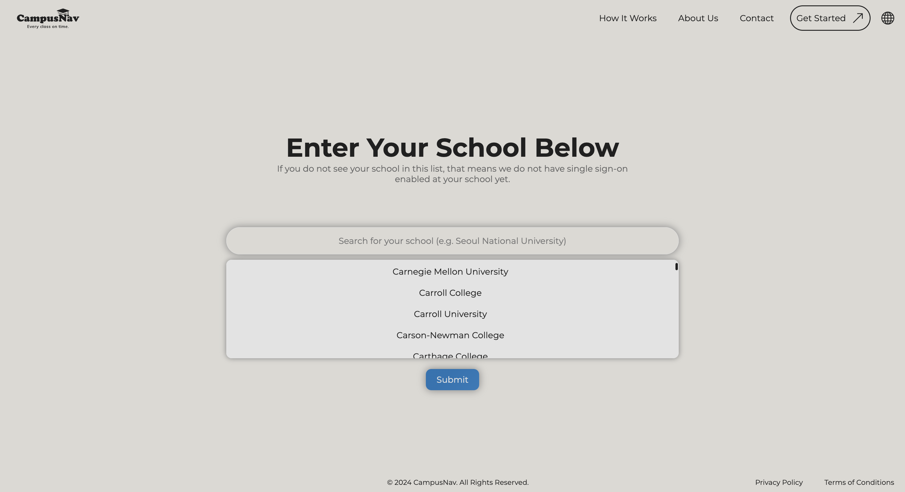
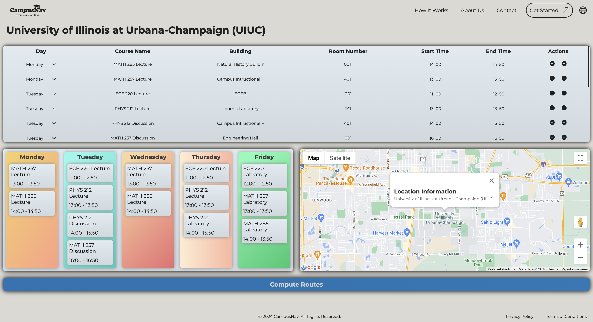
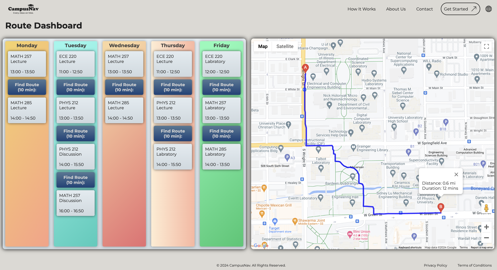

# CampusNav

**[CampusNav](https://campusnav-test.netlify.app/)** is a comprehensive web application designed to assist college students in navigating their campuses more efficiently. Its primary purpose is to simplify course registration by helping students determine whether the walking distances and times between their selected classes are manageable within the available timeframe. By integrating Google Maps or Apple Maps API, CampusNav provides accurate walking routes and times, ensuring students can plan their schedules with confidence, reducing the risk of class overlap or excessive time spent moving between locations.

[Visit CampusNav Demo Webpage](https://campusnav-test.netlify.app/)

## Table of Contents
- [Problem Statement](#problem-statement)
- [Key Features](#key-features)
- [Tech Stack](#tech-stack)
- [Usage](#usage)
- [Future Enhancements](#future-enhancements)
- [Screenshots](#screenshots)

- [License](#license)

## Problem Statement

For students at large universities, scheduling classes can be a challenging task. Many students find it difficult to estimate whether they have enough time to walk between buildings during their busy schedules. This leads to stress during course registration and often results in last-minute changes or missed classes.

Manually checking campus maps and estimating walking times is time-consuming and often inaccurate. Students need a better solution that automates this process and provides reliable walking times between classes. CampusNav addresses this issue by offering an efficient tool that calculates walking distances and times between campus buildings. It assists students in optimizing their schedules and making informed decisions during registration.

## Key Features

- **Class Schedule Input**  
  Users can input their class schedules, specifying the times and locations of each class. This information forms the basis for calculating walking times between locations.
  
- **Walking Time Calculation**  
  CampusNav uses Google Maps API or Apple Maps API to calculate walking distances and times between specified class locations. It provides real-time estimates of how long it will take to travel from one building to another.

- **Schedule Visualization**  
  The user's schedule is presented in a clean, easy-to-read format. Walking times are overlaid on the schedule, highlighting transitions between classes that may be too tight or require adjustments.

- **Optimized Routing**  
  CampusNav suggests optimal class schedules by minimizing walking times. This helps students select classes that are logistically feasible, ensuring they have ample time to transition between locations.

- **User-Friendly Interface**  
  A simple and intuitive interface allows students to quickly input their schedules, visualize walking times, and adjust their schedules as needed.

- **Future-Ready Enhancements**  
  Future updates to CampusNav may include features such as multi-modal transportation options (bike, scooter, public transport), user authentication for saving schedules, real-time updates for road closures or construction, and a mobile app version for on-the-go use.

## Tech Stack

CampusNav is built using the following technologies:

- **Frontend**:  
  - React (JavaScript) for a dynamic and responsive user interface.
  - HTML and CSS for structure and styling.

- **Backend**:  
  - Flask (Python) for handling server-side operations and API requests and handling.
  - ⚠️ **Note**: The backend code is not included in this repository due to security reasons.

- **Maps API**:  
  - Google Maps API for calculating walking routes, distances, and times between campus buildings.

## Usage

CampusNav is designed to be easy to use, with minimal setup required. Here’s how to get started:

1. **Input Schedule**  
   Start by entering your class schedule, including the times and locations of each class. CampusNav will then calculate the walking distances and times between consecutive classes.

2. **Calculate Walking Times**  
   Once your schedule is submitted, the app automatically uses the Maps API to compute the walking times between your class locations.

3. **Visualize Schedule**  
   View your schedule in a visual format, with walking times overlaid between classes. This allows you to quickly identify any transitions that may be too tight or require further adjustments.

4. **Optimize Schedule**  
   Based on the walking time calculations, you can modify your class schedule to ensure that you have sufficient time between classes. CampusNav also suggests optimal schedules that minimize walking times.

## Future Enhancements

CampusNav is an ongoing project with several planned features to enhance its functionality:

- **Multi-modal Transportation Options**  
  Support for multiple transportation methods, including biking, public transportation, and scooters, to calculate travel times more accurately.

- **User Authentication**  
  Allow users to create accounts and save their class schedules for easier access and updates.

- **Real-Time Updates**  
  Integration of real-time data for road closures, campus construction, or weather conditions that may affect walking times.

- **Mobile App Version**  
  A mobile app that enables students to manage their schedules on the go and receive real-time notifications about walking routes and travel times.

---

## Screenshots

Include screenshots here to give users a visual of how the app works. Add images like the class input screen, walking time calculations, and the schedule visualization.

### Search for School

### Class Schedule Input

### Walking Time Calculation + Schedule Visualization

---

## License

This project is licensed under the MIT License - see the [LICENSE.md](LICENSE.md) file for details.

---

## Contact and Demo

For more information or to see a live demo of CampusNav, visit: [CampusNav Demo](https://campusnav-test.netlify.app/).

Feel free to check out the source code or contribute to the project at: [CampusNav GitHub Repository](https://github.com/hscho421/CampusNav.git).

---
